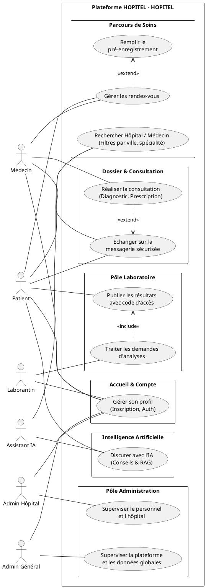
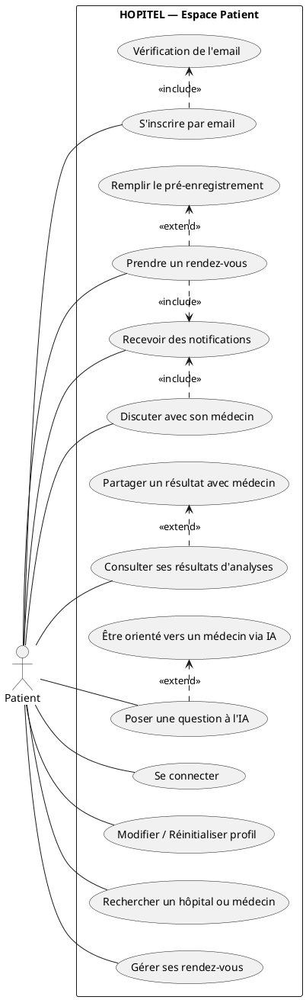
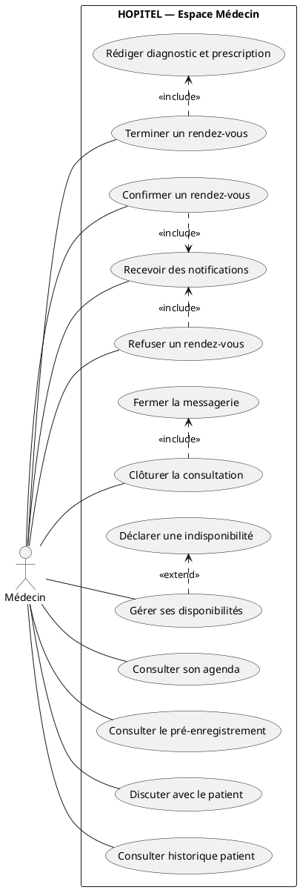
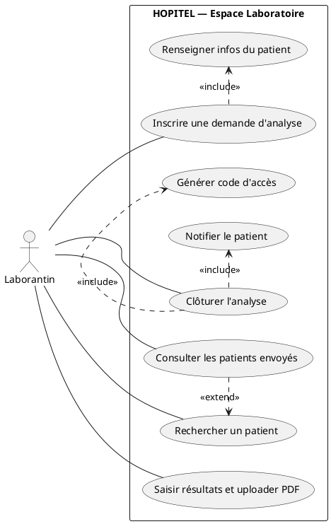
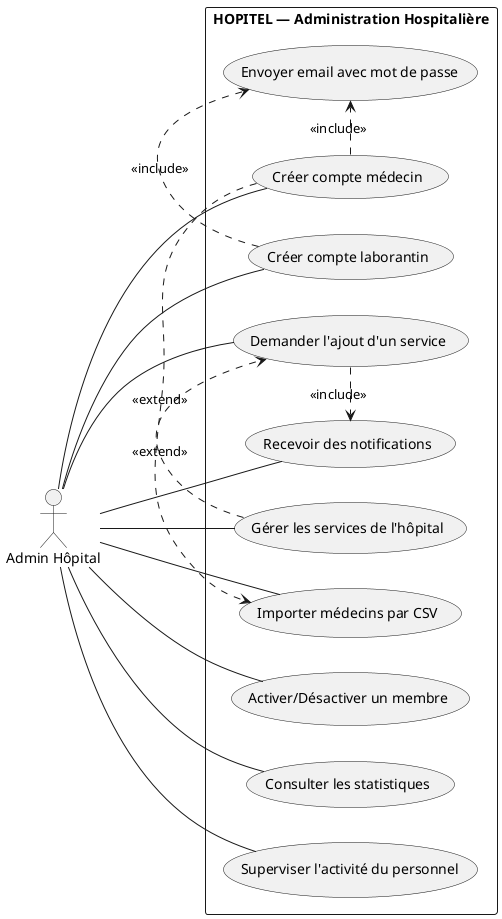
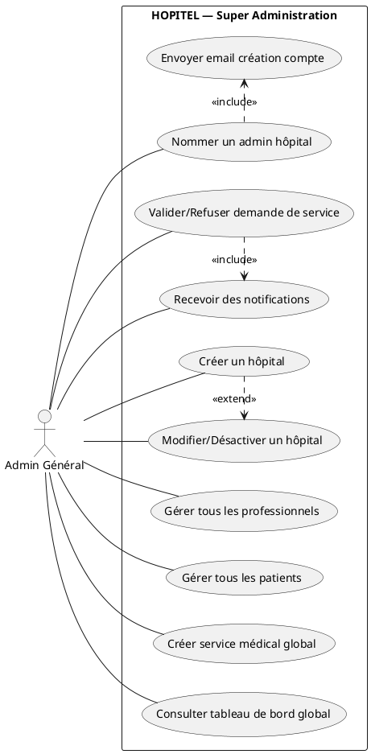
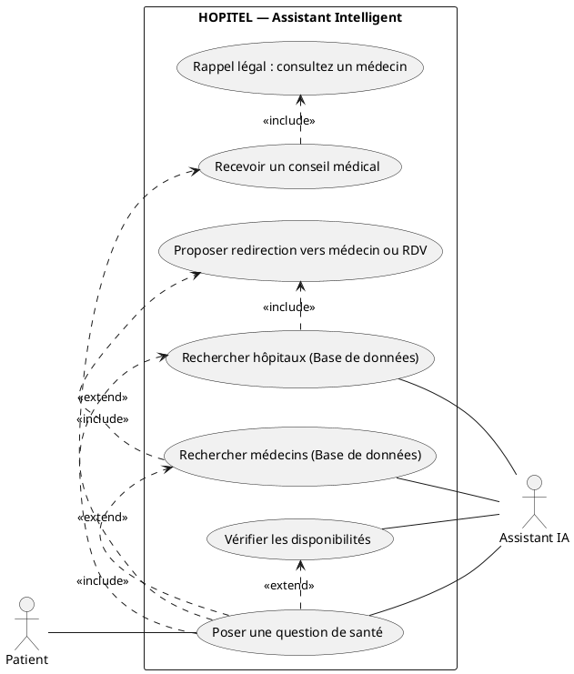

# Diagrammes de Cas d'Utilisation — HOPITEL

> **Tutoriel Draw.io pour avoir les "Bonhommes" UML** :
> Mermaid ne permet pas de faire des bonhommes classiques. Pour avoir un vrai diagramme pro (épuré, avec le vrai bonhomme bâton), il faut utiliser le format standard UML.
> 1. Crée un fichier `global.drawio` et ouvre-le.
> 2. Dans Draw.io, clique sur le **petit "+"** > **Advanced** > **PlantUML**.
> 3. Colle un bloc de code ci-dessous et valide. Tu auras ton diagramme pro avec les bonhommes !

---

## 1. Diagramme Global et Complet du Système

---

## 2. Patient

---

## 3. Médecin

---

## 4. Laborantin

---

## 5. Admin Hôpital

---

## 6. Admin Général

---

## 7. Assistant IA

