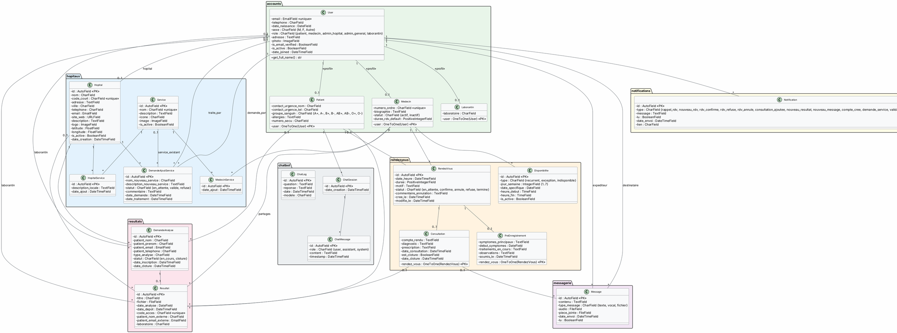

# Diagramme de Classes — HOPITEL

> Copiez le bloc PlantUML ci-dessous dans [PlantText](https://www.planttext.com/) ou tout éditeur PlantUML pour générer le diagramme.

```plantuml
@startuml Diagramme_Classes_HOPITEL_Benin

skinparam classAttributeIconSize 0
skinparam shadowing false
skinparam backgroundColor #FEFEFE
skinparam defaultFontName Inter
skinparam classFontSize 11
skinparam class {
  BackgroundColor #F8F9FA
  BorderColor #343A40
  ArrowColor #495057
}

' ═══════════════════════════════════════════════
' MODULE : ACCOUNTS (Utilisateurs & Profils)
' ═══════════════════════════════════════════════

package "accounts" #E8F5E9 {

  class User {
    - email : EmailField <<unique>>
    - telephone : CharField
    - date_naissance : DateField
    - sexe : CharField {M, F, Autre}
    - role : CharField {patient, medecin, admin_hopital, admin_general, laborantin}
    - adresse : TextField
    - photo : ImageField
    - is_email_verified : BooleanField
    - is_active : BooleanField
    - date_joined : DateTimeField
    --
    + get_full_name() : str
  }

  class Patient {
    - user : OneToOne(User) <<PK>>
    - contact_urgence_nom : CharField
    - contact_urgence_tel : CharField
    - groupe_sanguin : CharField {A+, A-, B+, B-, AB+, AB-, O+, O-}
    - allergies : TextField
    - numero_secu : CharField
  }

  class Medecin {
    - user : OneToOne(User) <<PK>>
    - numero_ordre : CharField <<unique>>
    - biographie : TextField
    - statut : CharField {actif, inactif}
    - duree_rdv_default : PositiveIntegerField
  }

  class Laborantin {
    - user : OneToOne(User) <<PK>>
    - laboratoire : CharField
  }

  User "1" -- "0..1" Patient : <<profil>>
  User "1" -- "0..1" Medecin : <<profil>>
  User "1" -- "0..1" Laborantin : <<profil>>
}

' ═══════════════════════════════════════════════
' MODULE : HOPITAUX (Établissements & Services)
' ═══════════════════════════════════════════════

package "hopitaux" #E3F2FD {

  class Hopital {
    - id : AutoField <<PK>>
    - nom : CharField
    - code_court : CharField <<unique>>
    - adresse : TextField
    - ville : CharField
    - telephone : CharField
    - email : EmailField
    - site_web : URLField
    - description : TextField
    - logo : ImageField
    - latitude : FloatField
    - longitude : FloatField
    - is_active : BooleanField
    - date_creation : DateTimeField
  }

  class Service {
    - id : AutoField <<PK>>
    - nom : CharField <<unique>>
    - description : TextField
    - icone : CharField
    - image : ImageField
    - is_active : BooleanField
  }

  class HopitalService {
    - id : AutoField <<PK>>
    - description_locale : TextField
    - date_ajout : DateTimeField
  }

  class MedecinService {
    - id : AutoField <<PK>>
    - date_ajout : DateTimeField
  }

  class DemandeAjoutService {
    - id : AutoField <<PK>>
    - nom_nouveau_service : CharField
    - description_nouveau_service : TextField
    - statut : CharField {en_attente, valide, refuse}
    - commentaire : TextField
    - date_demande : DateTimeField
    - date_traitement : DateTimeField
  }

  Hopital "1" -- "*" HopitalService
  Service "1" -- "*" HopitalService
  Medecin "1" -- "*" MedecinService
  Service "1" -- "*" MedecinService
  Hopital "1" -- "*" DemandeAjoutService
  User "1" -- "*" DemandeAjoutService : demande_par
  User "0..1" -- "*" DemandeAjoutService : traite_par
  Service "0..1" -- "*" DemandeAjoutService : service_existant
}

User "*" -- "0..1" Hopital : hopital

' ═══════════════════════════════════════════════
' MODULE : RENDEZVOUS
' ═══════════════════════════════════════════════

package "rendezvous" #FFF3E0 {

  class Disponibilite {
    - id : AutoField <<PK>>
    - type : CharField {recurrent, exception, indisponible}
    - jour_semaine : IntegerField {1..7}
    - date_specifique : DateField
    - heure_debut : TimeField
    - heure_fin : TimeField
    - is_active : BooleanField
  }

  class RendezVous {
    - id : AutoField <<PK>>
    - date_heure : DateTimeField
    - duree : PositiveIntegerField
    - motif : TextField
    - statut : CharField {en_attente, confirme, annule, refuse, termine}
    - commentaire_annulation : TextField
    - cree_le : DateTimeField
    - modifie_le : DateTimeField
  }

  class Consultation {
    - rendez_vous : OneToOne(RendezVous) <<PK>>
    - compte_rendu : TextField
    - diagnostic : TextField
    - prescription : TextField
    - date_consultation : DateTimeField
    - est_cloture : BooleanField
    - date_cloture : DateTimeField
  }

  class PreEnregistrement {
    - rendez_vous : OneToOne(RendezVous) <<PK>>
    - symptomes_principaux : TextField
    - debut_symptomes : DateField
    - traitements_en_cours : TextField
    - observations : TextField
    - soumis_le : DateTimeField
  }

  Medecin "1" -- "*" Disponibilite
  Patient "1" -- "*" RendezVous
  Medecin "1" -- "*" RendezVous
  RendezVous "1" -- "0..1" Consultation
  RendezVous "1" -- "0..1" PreEnregistrement
}

' ═══════════════════════════════════════════════
' MODULE : RESULTATS (Laboratoire)
' ═══════════════════════════════════════════════

package "resultats" #FCE4EC {

  class DemandeAnalyse {
    - id : AutoField <<PK>>
    - patient_nom : CharField
    - patient_prenom : CharField
    - patient_email : EmailField
    - patient_telephone : CharField
    - type_analyse : CharField
    - statut : CharField {en_cours, cloture}
    - date_inscription : DateTimeField
    - date_cloture : DateTimeField
  }

  class Resultat {
    - id : AutoField <<PK>>
    - titre : CharField
    - fichier : FileField
    - date_analyse : DateField
    - date_depot : DateTimeField
    - code_acces : CharField <<unique>>
    - patient_nom_externe : CharField
    - patient_email_externe : EmailField
    - laboratoire : CharField
  }

  DemandeAnalyse "1" -- "0..1" Resultat
  Hopital "1" -- "*" DemandeAnalyse
  User "0..1" -- "*" DemandeAnalyse : laborantin
  Patient "0..1" -- "*" DemandeAnalyse
  Patient "0..1" -- "*" Resultat
  User "0..1" -- "*" Resultat : laborantin
  Hopital "0..1" -- "*" Resultat
  Consultation "0..1" -- "*" Resultat
  Medecin "*" -- "*" Resultat : partages
}

' ═══════════════════════════════════════════════
' MODULE : MESSAGERIE
' ═══════════════════════════════════════════════

package "messagerie" #F3E5F5 {

  class Message {
    - id : AutoField <<PK>>
    - contenu : TextField
    - type_message : CharField {texte, vocal, fichier}
    - audio : FileField
    - piece_jointe : FileField
    - date_envoi : DateTimeField
    - lu : BooleanField
  }

  Consultation "0..1" -- "*" Message
  User "1" -- "*" Message : expediteur
  User "1" -- "*" Message : destinataire
}

' ═══════════════════════════════════════════════
' MODULE : CHATBOT (Assistant IA)
' ═══════════════════════════════════════════════

package "chatbot" #ECEFF1 {

  class ChatSession {
    - id : AutoField <<PK>>
    - date_creation : DateTimeField
  }

  class ChatMessage {
    - id : AutoField <<PK>>
    - role : CharField {user, assistant, system}
    - content : TextField
    - timestamp : DateTimeField
  }

  class ChatLog {
    - id : AutoField <<PK>>
    - question : TextField
    - reponse : TextField
    - date : DateTimeField
    - modele : CharField
  }

  Patient "1" -- "*" ChatSession
  ChatSession "1" -- "*" ChatMessage
}

' ═══════════════════════════════════════════════
' MODULE : NOTIFICATIONS
' ═══════════════════════════════════════════════

package "notifications" #FFFDE7 {

  class Notification {
    - id : AutoField <<PK>>
    - type : CharField {rappel_rdv, nouveau_rdv, rdv_confirme, rdv_refuse, rdv_annule, consultation_ajoutee, nouveau_resultat, nouveau_message, compte_cree, demande_service, validation_service, refus_service}
    - message : TextField
    - lu : BooleanField
    - date_envoi : DateTimeField
    - lien : CharField
  }

  User "1" -- "*" Notification
}

@enduml
```
