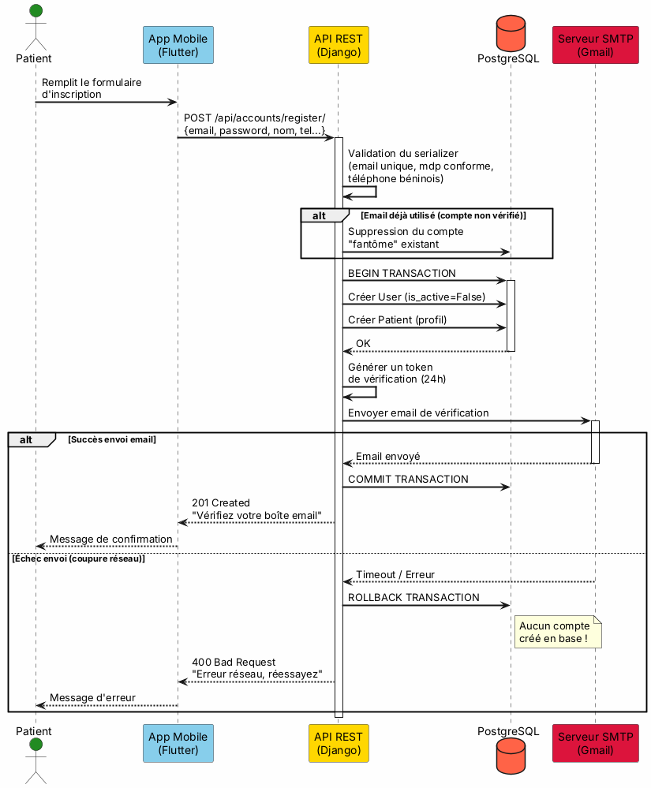
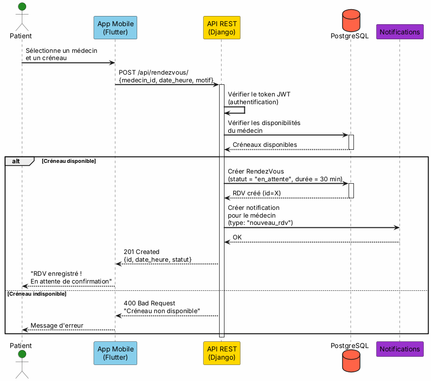
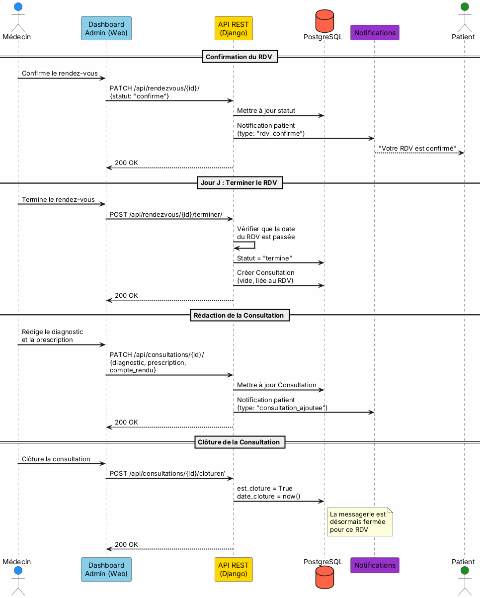
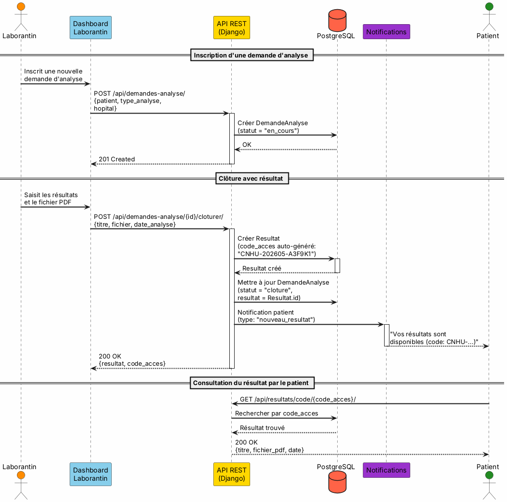
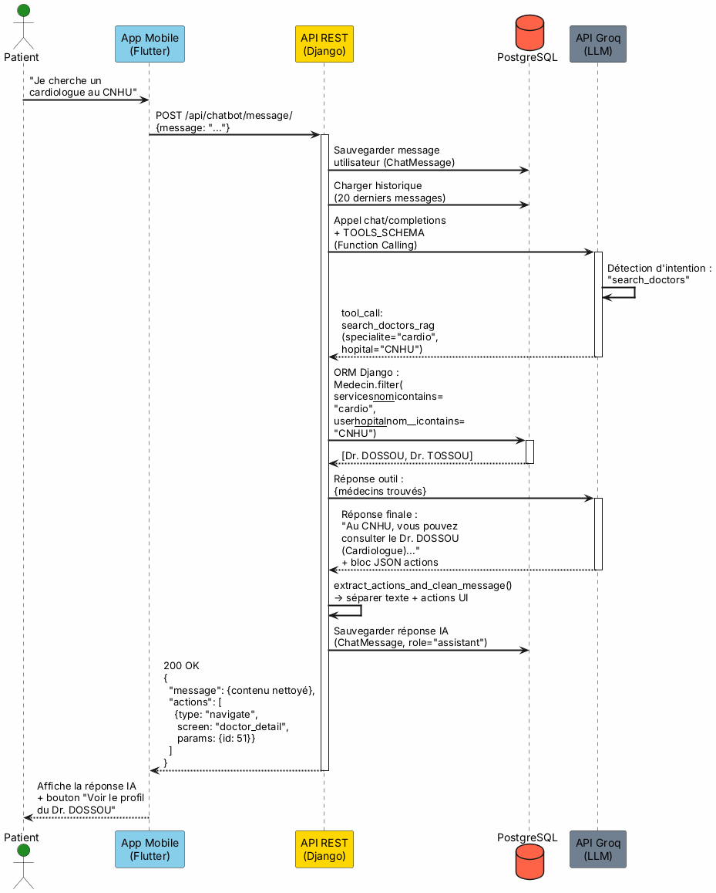
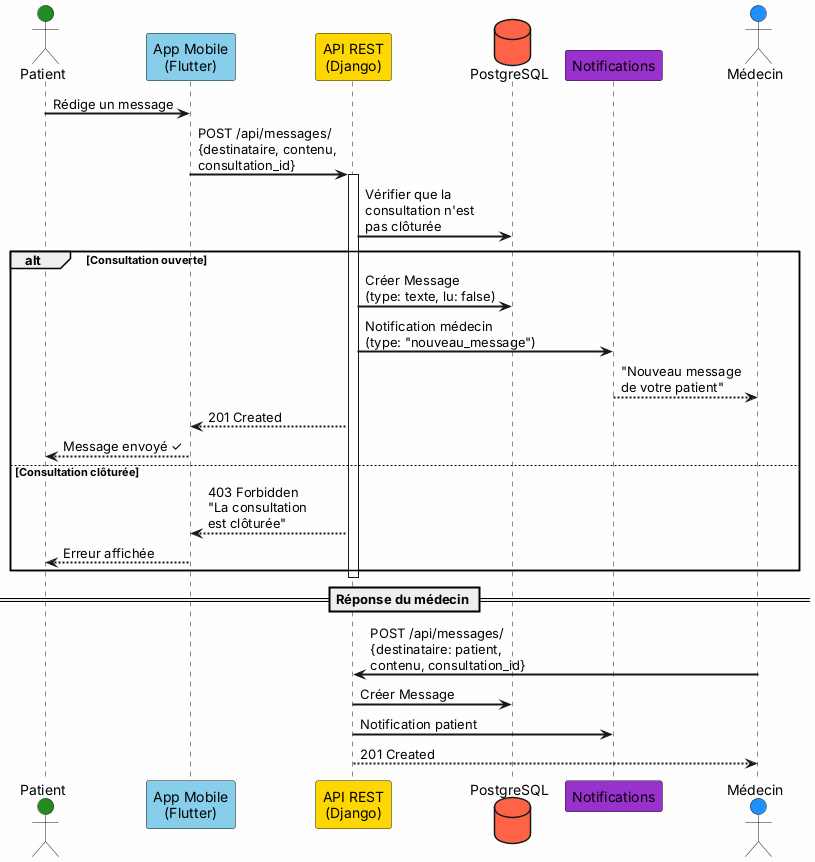

# Diagrammes de Séquence — E-Santé Bénin

> Copiez chaque bloc PlantUML ci-dessous dans [PlantText](https://www.planttext.com/) ou tout éditeur PlantUML pour générer les diagrammes.

---

## 1. Inscription d'un Patient (avec Transaction Atomique)

---

## 2. Prise de Rendez-vous

---

## 3. Flux de Consultation Complet (Médecin)

---

## 4. Flux Laboratoire (Analyse → Résultat)

---

## 5. Interaction avec l'Assistant IA (Chatbot RAG)

---

## 6. Messagerie Patient ↔ Médecin

